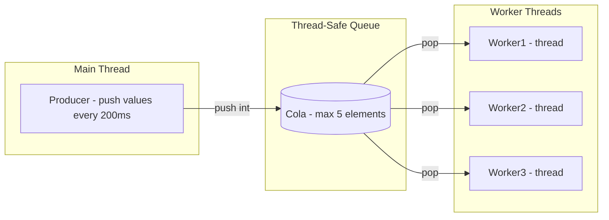
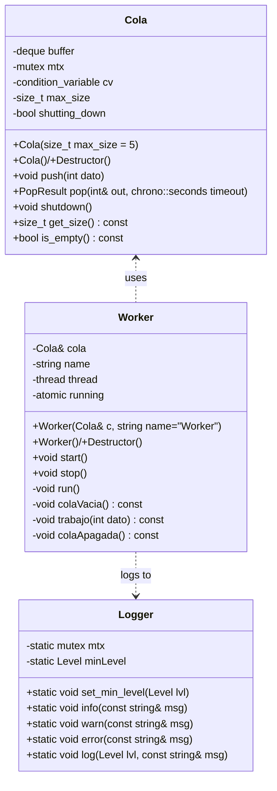

# Cola & Worker

Cola & Worker is a C++ project that demonstrates a **producer–consumer pattern** with a bounded, thread-safe queue and multiple worker threads.  
It has been designed as part of a technical test, but structured in a professional way, including **unit tests, logging, Docker support and CI/CD pipelines**.

---

## ✨ Features

- **Thread-safe bounded queue** (`Cola`) with configurable maximum size (Default: 5 elements).   
- **Multiple workers** (`Worker`) running in independent threads, consuming data concurrently.  
- **Logger** utility for thread-safe logs with levels (INFO, WARN, ERROR).  
- **Graceful shutdown** mechanism: workers wake up and exit cleanly.  
- **Unit tests** with GoogleTest, integrated into CMake.  
- **Reproducible builds** with Docker.  
- **Continuous Integration** with GitHub Actions (build + test + Docker validation).  

---

## 🏗 Architecture
The following diagram illustrates the internal architecture of the project.
It follows a producer–consumer pattern where:

The Main Thread simulates a producer pushing values into the queue at fixed intervals.

The Cola is a thread-safe bounded queue that stores up to 5 elements and synchronizes access among threads.

Three independent Worker Threads act as consumers, retrieving values from the queue concurrently.

This design demonstrates multithreading, synchronization with mutex and condition variables, and safe communication between producers and multiple consumers.


---

## 🗂 Class Diagram



---

## 🛠 Build Instructions

### Windows (Visual Studio 2022)

1. Open **Visual Studio 2022**.  
2. *Open folder* → select the project root (`cola-worker-test/`).  
3. Choose a configuration (`x64-Debug` or `Release`).  
4. Build the project (Ctrl+Shift+B).  
5. Run the generated binary `cola_worker.exe`.  

---

### Linux / WSL

Install required tools:
```
sudo apt update
sudo apt install -y build-essential cmake git
```

Build project:
```
git clone https://github.com/sergioguerreroblanco-oss/cola-worker-test.git
cd cola-worker-test
mkdir build && cd build
cmake .. -DCMAKE_BUILD_TYPE=Release
cmake --build .
./cola_worker
```

---

## 🧪 Unit Tests

This project includes unit tests implemented with GoogleTest and integrated into the CMake build system via CTest.
Tests validate the main behavior of the Cola (bounded queue) component, including maximum size enforcement, FIFO ordering, and shutdown behavior.

### Running Tests (Linux / Docker)

After building the project, run the following command inside the build directory:

```ctest --output-on-failure```

This will automatically discover and execute all registered GoogleTest cases.

### Running Tests (Windows)

On Windows, the project has been validated with Visual Studio 2022.
Tests can be executed directly from Test Explorer:
```Menu → Test → Run All Tests```

Alternatively, if CMake is installed and available in your PATH, you can also run from PowerShell:
```ctest --output-on-failure```

Example output:
```
Test project /app/build
    Start 1: ColaTest.KeepMaxBufferSize
1/3 Test #1: ColaTest.KeepMaxBufferSize ........ Passed
    Start 2: ColaTest.ExtractElements
2/3 Test #2: ColaTest.ExtractElements .......... Passed
    Start 3: ColaTest.ShutdownWakesUpImmediately
3/3 Test #3: ColaTest.ShutdownWakesUpImmediately Passed
100% tests passed, 0 tests failed out of 3
```

---

## 🐳 Docker

This project includes a Dockerfile to provide a reproducible build and test environment.

Build image

```docker build -t cola-worker:dev .```

Run tests inside container

```docker run --rm cola-worker:dev```

Run main binary

```docker run --rm cola-worker:dev ./build/cola_worker```

---

## 🔄 Continuous Integration

A GitHub Actions workflow (.github/workflows/ci.yml) is provided. It performs:

Build and test on ubuntu-latest using CMake and g++.

Build Docker image and run tests inside the container.

This ensures the project is validated in both native and containerized environments.

---

## 📂 Project Structure

```
cola-worker-test/
│
├── CMakeLists.txt           # Main build configuration
├── Dockerfile               # Reproducible environment
├── .dockerignore            # Files excluded from Docker context
├── .gitignore               # Files excluded from Git
├── README.md                # Project documentation
│
├── include/                 # Public headers
│   ├── cola.h
│   ├── worker.h
│   └── logger.h
│
├── src/                     # Implementation files
│   ├── main.cpp
│   ├── cola.cpp
│   ├── worker.cpp
│   └── logger.cpp
│
├── tests/                   # Unit tests
│   └── test_main.cpp
│
└── .github/workflows/       # CI/CD
    └── ci.yml

```

---

## 📌 Notes

C++ standard: project uses C++14 (set(CMAKE_CXX_STANDARD 14)).

Thread safety: ensured with std::mutex, std::condition_variable, and std::atomic.

Cross-platform: builds on Windows (MSVC), Linux (g++), and inside Docker.

Extensibility: Cola can be generalized to a template Cola<T> for other data types.

---

## ❤️ Acknowledgements

This project was developed as a technical test and extended to include professional practices such as unit testing, CI/CD and containerization.
