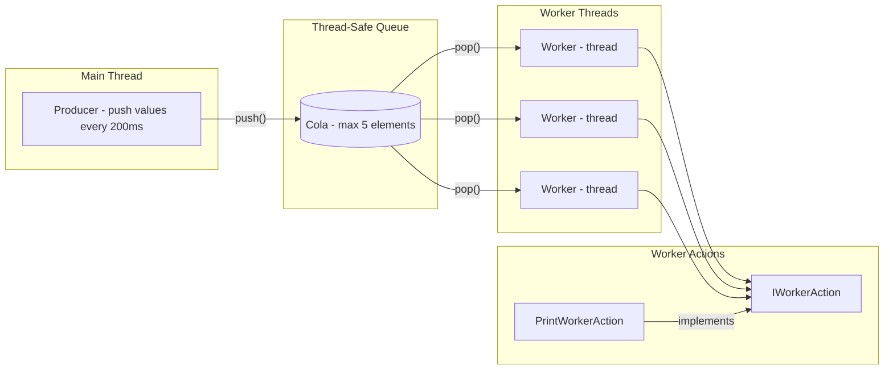
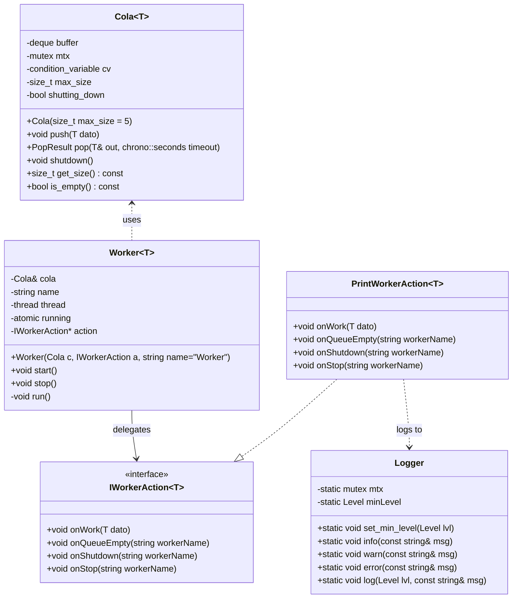

# Cola & Worker


Cola & Worker is a C++ project that demonstrates a producer–consumer pattern with a bounded, thread-safe queue and multiple worker threads.
It has been designed as part of a technical test, but structured in a professional way, including **templates, abstract interfaces, unit tests, logging, Docker support and CI/CD pipelines.**

---

## ✨ Features

- **Thread-safe bounded queue** (```Cola<T>```) implemented as a C++14 template with configurable maximum size (Default: 5 elements).
- **Multiple workers** (```Worker<T>```) running in independent threads, consuming data concurrently.
- **Abstract interface** (```IWorkerAction```) to decouple worker logic from concrete actions.
- **Concrete action** (```PrintWorkerAction```) that logs worker events.
- **Logger** utility for thread-safe logs with levels (DEBUG, INFO, WARN, ERROR).
- **Graceful shutdown mechanism**: workers wake up and exit cleanly.
- **Unit tests** with GoogleTest, integrated into CMake.
- **Reproducible builds** with Docker.
- **Continuous Integration** with GitHub Actions (build + test + Docker validation).

---

## 🏗 Architecture
The following diagram illustrates the internal architecture of the project.
- **Main Thread** simulates a producer pushing values into the queue at fixed intervals.
- **Cola<T>** is a thread-safe bounded queue that stores up to 5 elements and synchronizes access among threads.
- **Worker<T>** consumes values from the queue and delegates the actual handling of events to an action (strategy pattern).
- **IWorkerAction** defines the contract for worker actions.
- **PrintWorkerAction** implements this contract by logging messages.


---

## 🗂 Class Diagram



---

## 🛠 Build Instructions

### Windows (Visual Studio 2022)

1. Open **Visual Studio 2022**.  
2. *Open Folder* → select the project root (`cola-worker-test/`).  
3. Visual Studio will detect `CMakePresets.json`.  
4. In the toolbar, select a configuration (`debug` or `release`).  
5. Build (Ctrl+Shift+B).  
6. Run the generated binary `cola_worker.exe` from `out/build/<config>/`.

---

### Linux / WSL (Debian/Ubuntu based)

Install required tools:
```bash
sudo apt update
sudo apt install -y build-essential cmake ninja-build git
```
Clone repository:
```bash
git clone https://github.com/sergioguerreroblanco-oss/cola-worker-test.git
cd cola-worker-test
```
Release build (optimized, tests disabled):
```bash
cmake --preset release
cmake --build --preset release
./build/release/cola_worker
```
> Note: In **Debug** builds, unit tests are automatically enabled.  
> After building with the `debug` preset, you can run them with:
> ```bash
> ctest --preset debug --output-on-failure
> ```

Debug build (with tests enabled):
```bash
cmake --preset debug
cmake --build --preset debug
ctest --preset debug
./build/debug/cola_worker
```

---

## 🧪 Unit Tests

Unit tests are implemented with GoogleTest and integrated into the CMake build system via CTest.
They validate the main behavior of the queue (Cola<T>):
- Maximum size enforcement.
- FIFO ordering.
- Timeout behavior.
- Shutdown behavior.

### Running Tests (Windows)

On Windows, the project has been validated with Visual Studio 2022.
Tests can be executed directly from Test Explorer:
```Menu → Test → Run All Tests```

Alternatively, you can also build and run tests using the provided CMake presets:
```powershell
cmake --preset debug
cmake --build --preset debug
ctest --preset debug --output-on-failure
```

### Running Tests (Linux / Docker)

After building the project, run the following command inside the build directory:

```ctest --output-on-failure```

This will automatically discover and execute all registered GoogleTest cases.

### Example output:
(example output inside container) 
```

Test project /app/build
    Start 1: ColaTest.KeepMaxBufferSize
1/3 Test #1: ColaTest.KeepMaxBufferSize ........ Passed
    Start 2: ColaTest.ExtractElements
2/3 Test #2: ColaTest.ExtractElements .......... Passed
    Start 3: ColaTest.ShutdownWakesUpImmediately
3/3 Test #3: ColaTest.ShutdownWakesUpImmediately Passed
100% tests passed, 0 tests failed out of 3
```

---

## 🐳 Docker

This project includes a Dockerfile to provide a reproducible build and test environment.

Requires Docker installed and running on your system.

Build image:

```docker build -t cola-worker:dev .```

Run tests inside container:

```docker run --rm cola-worker:dev```

Run main binary:

```docker run --rm cola-worker:dev ./build/cola_worker```

By default, the container builds the project in /app/build/. The binary can be invoked as shown.


---

## 🔄 Continuous Integration

A GitHub Actions workflow (```.github/workflows/ci.yml```) is provided. It performs:
- Build and run unit tests on ```ubuntu-latest``` using CMake and g++.
- Build Docker image and execute the binary/tests inside the container.

This ensures that:
- The code always compiles on a clean environment.
- All unit tests pass successfully on each push/pull request.
- The project works both in native Linux and inside a reproducible Docker container.

---

## 📂 Project Structure

```
cola-worker-test/
│
├── .clang-format            # Code style configuration
├── .dockerignore
├── .gitignore
├── CMakeLists.txt           # Build configuration
├── CMakePresets.json        # Build presets (debug/release)
├── Dockerfile               # Docker build context
├── README.md                # Project documentation
│
├── docs/                    # Documentation
│   ├── Doxyfile             # Doxygen configuration
│   └── README.md            # Docs instructions
│
├── include/                 # Headers and template implementations
│   ├── cola.h
│   ├── cola.ipp
│   ├── IWorkerAction.h
│   ├── logger.h
│   ├── PrintWorkerAction.h
│   ├── worker.h
│   └── worker.ipp
│
├── scripts/                 # Utility scripts
│   └── generate_docs.sh     # Script to generate Doxygen docs
│
├── src/                     # Source files
│   ├── logger.cpp
│   └── main.cpp
│
├── tests/                   # Unit tests
│   └── test_main.cpp
│
└── .github/workflows/       # CI/CD pipelines
    └── ci.yml
```

---

## 📖 Documentation

This project uses [Doxygen](https://www.doxygen.nl/) to generate API documentation
from source code comments.

### Generate documentation

#### Windows (PowerShell)
```powershell
cd docs
doxygen Doxyfile
start html\index.html
```

#### Linux / WSL (Debian/Ubuntu based)
```bash
./scripts/generate_docs.sh
```

Open in your browser:
```bash
docs/html/index.html
```

For more details, see docs/README.md

---

## 🎨 Code Style (clang-format)

This project uses **clang-format** to enforce a consistent C++ code style.  
The formatting rules are defined in [`.clang-format`](./.clang-format). 

### Chosen Style

This project uses a `.clang-format` configuration derived from **Google C++ Style**,  
with a few adjustments tailored for readability and consistency:

- **IndentWidth: 4** → default Google style uses 2 spaces; 4 spaces give more clarity for nested code.  
- **ColumnLimit: 100** → avoids very long lines while still allowing expressive function names and templates.  
- **Language: Cpp** → ensures the formatter applies C++ rules (not generic C).  
- **Standard: Cpp11** → compatible setting for clang-format; matches well with the project’s target (C++14).  

### Windows (Visual Studio Code / PowerShell)

1. Install LLVM (includes clang-format):

    - Download the LLVM installer for Windows (`https://github.com/llvm/llvm-project/releases`)
    
    - During setup, check “Add LLVM to the system PATH”.

2. Verify installation:

```PowerShell
clang-format --version
```
3. Format all project files:
```PowerShell
clang-format -i include\*.h include\*.ipp src\*.cpp tests\*.cpp
```
### Linux / WSL (Debian/Ubuntu based)

1. Install clang-format:
```bash
sudo apt update
sudo apt install -y clang-format
```
2. Verify installation:
```bash
clang-format --version
```
3. Format all project files:
```bash
clang-format -i include/*.h include/*.ipp src/*.cpp tests/*.cpp
```

---

## 📌 Notes

- C++ Standard: C++14 (set(CMAKE_CXX_STANDARD 14)).
- Thread Safety: Managed with std::mutex, std::condition_variable, and std::atomic.
- Extensibility: Worker actions decoupled via `IWorkerAction` interface 
  → new behaviors can be added without modifying worker logic.
- Logging: Centralized Logger utility with severity levels.
- Cross-Platform: Builds on Windows (MSVC), Linux (g++) and Docker.
- Queue implementation: `Cola<T>` uses `std::deque` internally rather than a custom array-based buffer. This choice favors **simplicity, correctness, and STL optimizations**, while still enforcing the bounded size (default: 5 elements). A custom queue could have been implemented, but `std::deque` provides robust, well-tested behavior with minimal overhead.

---

## ❤️ Acknowledgements

This project was developed as a technical test and extended to include professional practices such as **templates, interfaces, logging, unit testing, CI/CD and containerization.**

